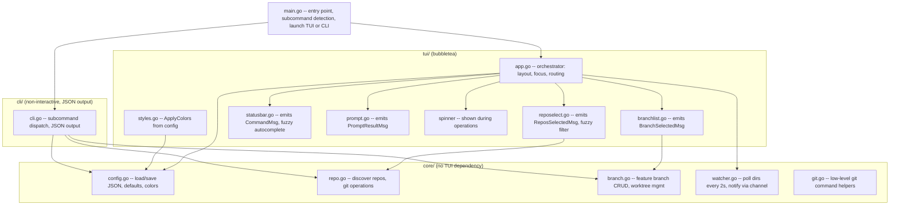
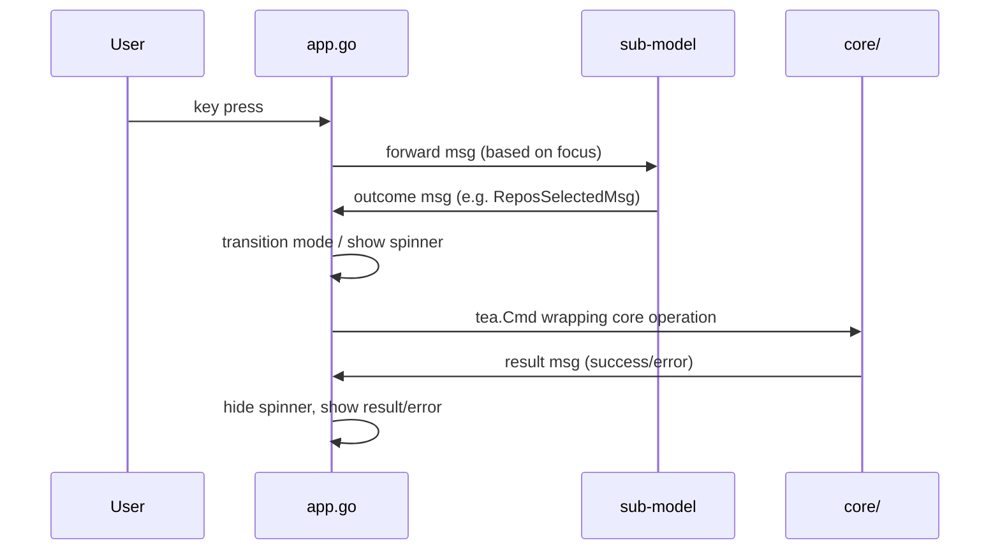

# WTMAN - worktree manager

## Architecture

### Design Principles

- **Core / TUI / CLI separation**: `core/` is pure Go with no TUI dependency. All git, filesystem, and config logic lives here. `tui/` contains bubbletea models that call into `core/`. `cli/` provides a non-interactive JSON-outputting interface that also calls into `core/`.
- **Nested delegation with outcome messages**: each TUI sub-model (branchlist, reposelect, statusbar, prompt) is a self-contained widget. It accepts input when focused and emits typed outcome messages (e.g. `ReposSelectedMsg`, `CommandMsg`). The sub-models don't know who owns them.
- **App as orchestrator**: `app.go` is purely a layout + routing orchestrator. It decides which widgets are visible, which one has focus, and how to react to their outcomes. Swapping from "sequential modes" to "side-by-side panels with Tab focus" later would only change `app.go`, not touch any sub-model.
- **Blocking UI during operations**: long-running git operations (create, delete, update, rename) run as background `tea.Cmd`s. While running, a spinner is shown in the status bar and all input is blocked. Simple and safe -- no race conditions.



### Message Flow



## Project Layout

```
wtman/
  go.mod
  go.sum
  main.go              -- entry point, flag parsing, subcommand detection; launches TUI or CLI
  cli/
    cli.go             -- non-interactive CLI: subcommand dispatch (ls, repos, new, rm, update, mv, pull),
                          JSON output to stdout, errors to stderr, per-command flag parsing
  core/
    config.go          -- Config struct, ColorsConfig struct, Load/Save, defaults
    repo.go            -- DiscoverRepos, IsGitRepo, RepoEntry
    branch.go          -- FeatureBranch (incl. HasDirty, NonMasterRepos), BranchToDirName/DirNameToBranch,
                          ListFeatureBranches (computes dirty/non-master status per repo),
                          CreateWorktrees, DeleteFeatureBranch, RenameFeatureBranch,
                          UpdateFeatureBranch (forceRemove flag), DirtyRemovedWorktrees,
                          PullSourceRepos (git pull --no-tags all repos under source_dir; parallel; skips detached HEAD and uninitialized submodules)
    workspace.go       -- CreateCursorWorkspace (generates .code-workspace file)
    watcher.go         -- DirWatcher: polls source/target dirs every 2s, sends updates on a channel
    git.go             -- low-level git command helpers (runGit, branchExists, defaultStartPoint, IsWorktreeDirty, IsOnMainBranch, etc.)
  tui/
    app.go             -- root bubbletea Model: orchestrator for layout, focus, mode transitions, timed error display
    branchlist.go      -- feature branch list: date+time (YYYY-MM-DD HH:MM) | name | repos header, up/down/j/k, Enter for update, d/Backspace/Delete for delete, o for open (post_command), ? for help, selection stability by name, dirty * and non-master ! markers
    reposelect.go      -- repo multi-select: up/down, Space toggle, fuzzy filter, ESC cancel/clear
    statusbar.go       -- / to enter command mode, fuzzy autocomplete, Tab/Up/Down cycling, ESC/Enter
    prompt.go          -- single-line text input (branch name, rename, confirmations)
    styles.go          -- ApplyColors(ColorsConfig), lipgloss style variables
    messages.go        -- shared message types (outcome messages, watcher events, operation results, DirtyWorktreesMsg, clearErrorMsg)
```

## Config

File: `~/.config/wtman/config.json`

```json
{
  "source_dir": "/path/to/repos",
  "target_dir": "/path/to/branches",
  "post_command": "tmux split-window -h 'cd {{dir}} && cursor --agent'",
  "scan_depth": 1,
  "colors": {
    "title": "99",
    "success": "48",
    "muted": "245",
    "selected_bg": "237",
    "accent": "87",
    "error": "203",
    "separator": "240",
    "selected_fg": "255"
  }
}
```

- `source_dir` / `target_dir` -- overridable at runtime via `/source-dir` and `/target-dir` commands (persisted to config); prompt shows current value
- `post_command` -- shell command run after worktrees are created; `{{dir}}` is replaced with the feature branch directory path
- `scan_depth` -- how deep to look for git repos in source dir
- `colors` -- ANSI 256-color codes for all UI elements; omitted fields fall back to defaults. Field names are functional:
  - `title` -- title bar, spinner
  - `success` -- [x] checkmarks
  - `muted` -- hints, headers, unchecked boxes, autocomplete
  - `selected_bg` -- selected row background
  - `accent` -- filter text, cursor, active autocomplete item
  - `error` -- error messages
  - `separator` -- table separator lines
  - `selected_fg` -- selected row foreground

## CLI Interface

Non-interactive, JSON-outputting interface for scripting and Cursor skills. No subcommand launches the TUI (backward compatible).

### Global Flags

- `--config <path>` -- config file (default `~/.config/wtman/config.json`)
- `-s`, `--source-dir` -- override source repos directory
- `-t`, `--target-dir` -- override target branches directory
- `-h` -- show usage

### Commands

| Command | Description |
|---------|-------------|
| `wtman ls` | List feature branches |
| `wtman repos` | List available source repos |
| `wtman new <branch> <repos> [-n]` | Create branch with worktrees (`-n` skips post hook) |
| `wtman rm <branch> [-f]` | Delete branch (`-f` force even if dirty) |
| `wtman update <branch> <repos> [-f]` | Set repos for branch (`-f` force dirty removal) |
| `wtman mv <old> <new>` | Rename branch |
| `wtman pull` | Pull all repos under `source_dir` (`git pull --no-tags` on each repo's current branch) |

`<repos>` is a comma-separated list of repo names. Every subcommand supports `-h`.

### Output Format

All commands output JSON to stdout. Errors go to stderr as plain text with exit code 1.

**`wtman ls`:**
```json
[{"name":"feat-x","date":"2026-03-15 14:30","repos":["auth","billing"],"path":"/b/feat-x","dirty":true,"non_master":["auth"]}]
```

The `date` field is the feature-branch directory modification time in local timezone, formatted as `YYYY-MM-DD HH:MM` (`core.BranchCreatedAtLayout`), same as the TUI Date column.

**`wtman repos`:**
```json
[{"name":"auth-service","path":"/src/auth-service"}]
```

**`wtman new`:**
```json
{"branch":"feat-x","path":"/b/feat-x","repos":["auth","billing"]}
```

**`wtman rm`, `mv`, `pull`, `update` (success):**
```json
{"ok":true}
```

**`wtman update` (dirty worktrees, no `-f`):**
```json
{"error":"dirty","repos":["auth"]}
```

## Branch Name Encoding

Branch names containing `/` (e.g. `a/feat/add-field`) are encoded on disk by replacing `/` with `--` (e.g. directory `a--feat--add-field`). The git branch name itself uses the original `/` form. Encoding/decoding is handled by `BranchToDirName` / `DirNameToBranch` and is transparent to the user.

## TUI Modes and Flow

### Mode 1: Branch List (default view)

```
  WTMAN - worktree manager

  Date             | Branch                  | Repos
  -----------------+-------------------------+-------------------------
  2026-01-01 09:15 | rename-report-fields    | billing, report-engine
  2026-03-15 14:30 | migrate-auth-service    | auth, billing, paym...    <- highlighted bg
  2026-04-10 18:45 | fix-payment-rounding    | payment-gateway

  j/k navigate  ENTER update  o open  d delete  / command  ? help
```

- j/k or Up/Down to navigate; selected row has a highlighted background (full-width color band, no cursor character)
- Enter on a selected branch enters Update Mode (Mode 2, pre-populated)
- d, Backspace, or Delete on a selected branch triggers delete confirmation
- `o` runs the post_command for the selected branch (same as after `new`)
- `?` opens the help screen listing all shortcuts and commands
- `/` opens command bar
- `q` quits
- Ctrl+C / Ctrl+D quits from any mode
- Commands: `/new`, `/delete`, `/rename`, `/pull`, `/source-dir` (shows current), `/target-dir` (shows current), `/sort-by-name`, `/sort-by-date`
- Table has a header row (Date | Branch | Repos) with a separator line; Date shows directory mtime to minute precision (`2006-01-02 15:04`, local time)
- Repos column shows sorted repo names, truncated with `...` if they exceed available width
- List auto-refreshes when watcher detects changes in target dir
- Branch list dirty marker: red `*` after branch name for branches with uncommitted changes
- Branch list non-master marker: red `!` before repo names whose source repo is not on master/main
- Selection stability: on refresh, the currently selected branch is preserved by name
- **Error display**: errors from any operation appear between the repo list and the status bar, styled in error color, auto-dismissed after 5 seconds. All errors are surfaced -- no swallowed errors.

### Mode 1: With command bar open (after pressing `/`)

```
  WTMAN - worktree manager

  Date             | Branch                  | Repos
  -----------------+-------------------------+-------------------------
  2026-01-01 09:15 | rename-report-fields    | billing, report-engine
  2026-03-15 14:30 | migrate-auth-service    | auth, billing, paym...    <- highlighted bg
  2026-04-10 18:45 | fix-payment-rounding    | payment-gateway

  /ne_
   /new         /rename        /delete
```

- Autocomplete row below input shows fuzzy-matching commands (dimmed), non-matching disappear. Fuzzy logic is same as repo filter: exact substrings rank highest, then prefix/boundary/consecutive matches. Input is matched against command names without the `/` prefix.
- Tab / Down cycles forward through matches, Shift+Tab / Up cycles backward
- Selected autocomplete suggestion shown in accent color bold
- Enter executes the typed or selected command; single remaining match auto-completes
- ESC cancels command input

### Mode 2: Repo Select (via `/new` or Enter on existing branch)

For `/new` -- empty selection, all repos shown.
For update (Enter) -- repos already in the feature branch are pre-selected.

```
  WTMAN - worktree manager -- new feature branch

  [ ] auth-service
  [ ] billing-api
  [x] payment-gateway                                                <- highlighted bg
  [x] report-engine
  [ ] scheduler
  [ ] user-management

  up/down navigate  SPACE toggle  type to filter  ESC cancel  ENTER confirm
```

- Up/Down to navigate; selected row has highlighted background
- Space to toggle selection; `[x]` rendered in green
- Typing applies fuzzy filter: exact substrings rank highest, then prefix matches, word-boundary matches (after `-`, `_`, `/`), and consecutive char matches. E.g. `pga` matches `payment-gateway`.
- ESC clears filter; ESC with empty filter cancels mode
- Enter with 1+ selected repos proceeds to branch name prompt (for `/new`) or checks for dirty worktrees and applies changes (for update)
- Repos sorted alphabetically by name (when unfiltered) or by fuzzy score (when filtered)
- Status bar shows selected count next to confirm: `ENTER confirm (2)`
- List auto-refreshes when watcher detects changes in source dir

### Mode 2: With filter typed

```
  WTMAN - worktree manager -- new feature branch

  [x] payment-gateway                                                <- highlighted bg
  [x] report-engine


  Filter: re_
  up/down navigate  SPACE toggle  ESC clear filter  ENTER confirm (2)
```

### Branch Name Prompt (after confirming repos in `/new`)

```
  WTMAN - worktree manager -- new feature branch

  Selected: payment-gateway, report-engine

  Branch name: my-new-feature_


  ENTER create  ESC back
```

### Delete Confirmation (on `d` / Backspace / Delete or `/delete`)

```
  WTMAN - worktree manager

  Date             | Branch                  | Repos
  ...
  2026-03-15 14:30 | migrate-auth-service    | auth, billing, paym...    <- highlighted bg
  ...

  Delete "migrate-auth-service"? Removes worktrees & branches.
  ENTER/y confirm  ESC/n cancel
```

### Rename Prompt (on `/rename`)

```
  WTMAN - worktree manager

  Date             | Branch                  | Repos
  ...
  2026-03-15 14:30 | migrate-auth-service    | auth, billing, paym...    <- highlighted bg
  ...

  Rename to: migrate-auth-v2_
  ENTER rename  ESC cancel
```

### Help Screen (on `?`)

```
  WTMAN - worktree manager

  Shortcuts

  j / ↓           move down
  k / ↑           move up
  ENTER           update repos in selected branch
  o               run post_command for selected branch
  d / DEL         delete selected branch
  / + command     command palette

  Commands

  /new            create a new feature branch
  /delete         delete selected branch
  /rename         rename selected branch
  /pull           git pull --no-tags all repos in source-dir
  /sort-by-date   sort branches by creation date
  /sort-by-name   sort branches alphabetically
  /source-dir     change source repos directory
  /target-dir     change target (branches) directory

  press any key to close
```

- Any key (including `?`, `q`, ESC, Enter) closes the help screen and returns to the branch list.

### Spinner During Operations

```
  WTMAN - worktree manager

  Date             | Branch                  | Repos
  ...

  . Creating worktrees...
```

All input is blocked while a spinner is active. The spinner uses the `bubbles/spinner` component which ticks automatically via `tea.Cmd`.

## Core Operations Detail

### CreateWorktrees(repos []RepoEntry, branch string, targetDir string) error

1. Create `targetDir/<encoded-branch>/` directory (branch `/` encoded as `--`)
2. For each repo: `git worktree prune` (clean stale refs), then `git worktree add targetDir/<encoded-branch>/repoName branch`
   - If branch exists locally or on origin, check it out
   - If branch doesn't exist, create from main/master
   - **Per-repo errors are collected, not fatal** -- all repos are attempted even if some fail. Error message lists all failures.
3. Create Cursor workspace file from repos actually on disk (not the requested list, handles partial failures)
4. Run `post_command` with `{{dir}}` replaced by `targetDir/<encoded-branch>/`
5. Post-command and workspace file run regardless of partial failures

### CreateCursorWorkspace(branchDir string, repoNames []string) error

Creates a `.code-workspace` file in the branch directory so the user can open all worktree repos in a single Cursor window with multi-root workspace support.

1. Build the workspace JSON with a `folders` array -- one entry per repo, using relative paths (just the repo directory name)
2. Write `targetDir/<encoded-branch>/workspace.code-workspace`
3. The file uses the standard VS Code / Cursor workspace format:
   ```json
   {
     "folders": [
       { "path": "billing-api" },
       { "path": "payment-gateway" }
     ],
     "settings": {}
   }
   ```
4. Called after CreateWorktrees and after UpdateFeatureBranch (to keep the workspace in sync with the current repo set)

### DeleteFeatureBranch(targetDir, branch string, force bool) error

1. For each worktree under `targetDir/<encoded-branch>/`:
   - Resolve main repo via `.git` file
   - `git worktree remove <path>` (with --force if forced)
2. For each main repo discovered:
   - `git worktree prune`
   - `git branch -d branch` (or -D if force)
3. Remove `targetDir/<encoded-branch>/` directory

### RenameFeatureBranch(targetDir, oldName, newName string) error

1. For each worktree under `targetDir/<encoded-old>/`:
   - `git branch -m oldName newName` inside the worktree
2. Rename directory `targetDir/<encoded-old>` to `targetDir/<encoded-new>`

### DirtyRemovedWorktrees(repos []RepoEntry, branch, targetDir string) []string

Called before UpdateFeatureBranch. Computes which repos would be removed by the update and checks each for uncommitted changes (`git status --porcelain`). Returns the list of dirty repo names.

### UpdateFeatureBranch(repos []RepoEntry, branch, targetDir string, forceRemove bool) error

1. Discover current worktrees under `targetDir/<encoded-branch>/`
2. Compute diff: repos to add, repos to remove
3. For removals: `git worktree remove` (with `--force` if `forceRemove`), `git worktree prune`. Directory is always cleaned up via `os.RemoveAll` after removal attempt. **Does not delete the git branch** -- the branch is still in use by other repos in the feature branch.
4. For additions: same as CreateWorktrees per-repo logic (per-repo errors collected, not fatal). Runs `git worktree prune` before adding to clean up stale refs from previous removals.
5. Regenerate Cursor workspace file from repos actually on disk

**Update flow in TUI:**
1. User confirms repo selection → `DirtyRemovedWorktrees` checks for dirty removals
2. If no dirty repos → proceeds with `forceRemove=false`
3. If dirty repos found → shows confirmation: "Dirty worktrees: X, Y. Force remove? (uncommitted changes will be lost)"
4. On confirm → `forceRemove=true`; on deny → back to branch list

### PullSourceRepos(sourceDir string, scanDepth int) error

1. `DiscoverRepos(sourceDir, scanDepth)` for the repo list
2. For each repo, run `git pull --no-tags` in parallel (goroutine per repo)
3. **Skip** repos where `HEAD` is detached (`rev-parse --abbrev-ref HEAD` returns `HEAD`) — linked worktrees, not the main checkout
4. **Skip** repos whose directory contains only `.git` (no checked-out files) — uninitialized submodules; pulling would dirty the index without a checkout
5. Collect per-repo errors, sort messages, return a combined error if any failed

### DirWatcher

- Runs in a goroutine, polls source and target dirs every 2 seconds
- Sends events on a channel when directory listing changes (new/removed entries)
- Bubbletea subscribes via `tea.Cmd` that blocks on channel read; re-subscribes after each event

## Performance

### Parallel branch loading

`ListFeatureBranches` runs several git subprocesses per repo (dirty check, non-master check) sequentially. With multiple branches and repos, startup can take several seconds.

Fix: parallelize work across branches using goroutines + `sync.WaitGroup`. Each branch's repos are also checked in parallel. A `sync.Mutex` guards slice/map writes. This keeps the same external API and output order.

## Dependencies

- `github.com/charmbracelet/bubbletea` -- TUI framework (Elm architecture)
- `github.com/charmbracelet/lipgloss` -- styling
- `github.com/charmbracelet/bubbles` -- text input, spinner components
- Standard library for everything else (os/exec for git, encoding/json for config, filepath for paths)

## Build

```bash
cd wtman && go build -o wtman .
```

Produces a single static binary.
