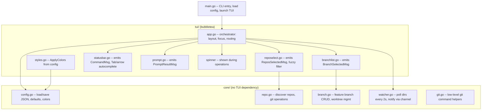
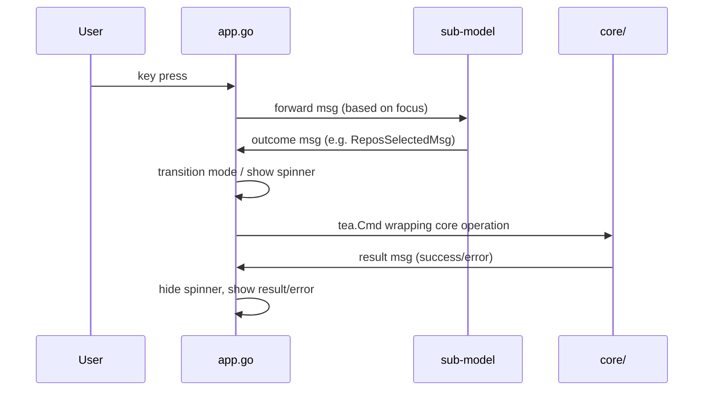

# wtman -- Go TUI Worktree Manager

## Architecture

### Design Principles

- **Core / TUI separation**: `core/` is pure Go with no TUI dependency. All git, filesystem, and config logic lives here. `tui/` contains bubbletea models that call into `core/`.
- **Nested delegation with outcome messages**: each TUI sub-model (branchlist, reposelect, statusbar, prompt) is a self-contained widget. It accepts input when focused and emits typed outcome messages (e.g. `ReposSelectedMsg`, `CommandMsg`). The sub-models don't know who owns them.
- **App as orchestrator**: `app.go` is purely a layout + routing orchestrator. It decides which widgets are visible, which one has focus, and how to react to their outcomes. Swapping from "sequential modes" to "side-by-side panels with Tab focus" later would only change `app.go`, not touch any sub-model.
- **Blocking UI during operations**: long-running git operations (create, delete, update, rename) run as background `tea.Cmd`s. While running, a spinner is shown in the status bar and all input is blocked. Simple and safe -- no race conditions.



### Message Flow



## Project Layout

```
wtman/
  go.mod
  go.sum
  main.go              -- entry point, flag parsing, config load, start TUI
  core/
    config.go          -- Config struct, ColorsConfig struct, Load/Save, defaults
    repo.go            -- DiscoverRepos, IsGitRepo, RepoEntry
    branch.go          -- FeatureBranch, BranchToDirName/DirNameToBranch (/ <-> --),
                          ListFeatureBranches, CreateWorktrees,
                          DeleteFeatureBranch (removes worktrees + git branch -d + prune),
                          RenameFeatureBranch (renames dir + git branch -m in each worktree),
                          UpdateFeatureBranch (add/remove repos)
    workspace.go       -- CreateCursorWorkspace (generates .code-workspace file)
    watcher.go         -- DirWatcher: polls source/target dirs every 2s, sends updates on a channel
    git.go             -- low-level git command helpers (runGit, branchExists, defaultStartPoint, etc.)
  tui/
    app.go             -- root bubbletea Model: orchestrator for layout, focus, mode transitions
    branchlist.go      -- feature branch list: date | name | repos header, up/down, Enter for update
    reposelect.go      -- repo multi-select: up/down, Space toggle, fuzzy filter, ESC cancel/clear
    statusbar.go       -- / to enter command mode, Tab/Up/Down autocomplete cycling, ESC/Enter
    prompt.go          -- single-line text input (branch name, rename, confirmations)
    styles.go          -- ApplyColors(ColorsConfig), lipgloss style variables
    messages.go        -- shared message types (outcome messages, watcher events, operation results)
```

## Config

File: `~/.config/wtman/config.json`

```json
{
  "source_dir": "/path/to/repos",
  "target_dir": "/path/to/branches",
  "post_command": "tmux split-window -h 'cd {{dir}} && cursor --agent'",
  "scan_depth": 1,
  "colors": {
    "primary": "63",
    "green": "42",
    "dimmed": "241",
    "highlight": "236",
    "cyan": "86",
    "red": "196",
    "separator": "238",
    "selected_fg": "255"
  }
}
```

- `source_dir` / `target_dir` -- overridable at runtime via `/source-dir` and `/target-dir` commands (persisted to config)
- `post_command` -- shell command run after worktrees are created; `{{dir}}` is replaced with the feature branch directory path
- `scan_depth` -- how deep to look for git repos in source dir
- `colors` -- ANSI 256-color codes for all UI elements; omitted fields fall back to defaults

## Branch Name Encoding

Branch names containing `/` (e.g. `a/feat/add-field`) are encoded on disk by replacing `/` with `--` (e.g. directory `a--feat--add-field`). The git branch name itself uses the original `/` form. Encoding/decoding is handled by `BranchToDirName` / `DirNameToBranch` and is transparent to the user.

## TUI Modes and Flow

### Mode 1: Branch List (default view)

```
  wtman

  Date       | Branch                  | Repos
  -----------+-------------------------+-------------------------
  2026-01-01 | rename-report-fields    | billing, report-engine
  2026-03-15 | migrate-auth-service    | auth, billing, paym...    <- highlighted bg
  2026-04-10 | fix-payment-rounding    | payment-gateway

  up/down navigate  ENTER update  / command
```

- Up/Down to navigate; selected row has a highlighted background (full-width color band, no cursor character)
- Enter on a selected branch enters Update Mode (Mode 2, pre-populated)
- `/` opens command bar
- `q` quits
- Ctrl+C / Ctrl+D quits from any mode
- Commands: `/new`, `/delete`, `/rename`, `/source-dir`, `/target-dir`, `/sort-by-name`, `/sort-by-date`
- Table has a header row (Date | Branch | Repos) with a separator line
- Repos column shows sorted repo names, truncated with `...` if they exceed available width
- List auto-refreshes when watcher detects changes in target dir

### Mode 1: With command bar open (after pressing `/`)

```
  wtman

  Date       | Branch                  | Repos
  -----------+-------------------------+-------------------------
  2026-01-01 | rename-report-fields    | billing, report-engine
  2026-03-15 | migrate-auth-service    | auth, billing, paym...    <- highlighted bg
  2026-04-10 | fix-payment-rounding    | payment-gateway

  /ne_
   /new         /rename        /delete
```

- Autocomplete row below input shows matching commands (dimmed), non-matching disappear
- Tab / Down cycles forward through matches, Shift+Tab / Up cycles backward
- Selected autocomplete suggestion shown in cyan bold
- Enter executes the typed or selected command
- ESC cancels command input

### Mode 2: Repo Select (via `/new` or Enter on existing branch)

For `/new` -- empty selection, all repos shown.
For update (Enter) -- repos already in the feature branch are pre-selected.

```
  wtman -- new feature branch

  [ ] auth-service
  [ ] billing-api
  [x] payment-gateway                                                <- highlighted bg
  [x] report-engine
  [ ] scheduler
  [ ] user-management

  up/down navigate  SPACE toggle  type to filter  ESC cancel  ENTER confirm
```

- Up/Down to navigate; selected row has highlighted background
- Space to toggle selection; `[x]` rendered in green
- Typing applies fuzzy filter: exact substrings rank highest, then prefix matches, word-boundary matches (after `-`, `_`, `/`), and consecutive char matches. E.g. `pga` matches `payment-gateway`.
- ESC clears filter; ESC with empty filter cancels mode
- Enter with 1+ selected repos proceeds to branch name prompt (for `/new`) or applies changes (for update)
- Repos sorted alphabetically by name (when unfiltered) or by fuzzy score (when filtered)
- Status bar shows selected count next to confirm: `ENTER confirm (2)`
- List auto-refreshes when watcher detects changes in source dir

### Mode 2: With filter typed

```
  wtman -- new feature branch

  [x] payment-gateway                                                <- highlighted bg
  [x] report-engine


  Filter: re_
  up/down navigate  SPACE toggle  ESC clear filter  ENTER confirm (2)
```

### Branch Name Prompt (after confirming repos in `/new`)

```
  wtman -- new feature branch

  Selected: payment-gateway, report-engine

  Branch name: my-new-feature_


  ENTER create  ESC back
```

### Delete Confirmation (on `/delete`)

```
  wtman

  Date       | Branch                  | Repos
  ...
  2026-03-15 | migrate-auth-service    | auth, billing, paym...    <- highlighted bg
  ...

  Delete "migrate-auth-service"? Removes worktrees & branches.
  y confirm  n/ESC cancel
```

### Rename Prompt (on `/rename`)

```
  wtman

  Date       | Branch                  | Repos
  ...
  2026-03-15 | migrate-auth-service    | auth, billing, paym...    <- highlighted bg
  ...

  Rename to: migrate-auth-v2_
  ENTER rename  ESC cancel
```

### Spinner During Operations

```
  wtman

  Date       | Branch                  | Repos
  ...

  . Creating worktrees...
```

All input is blocked while a spinner is active. The spinner uses the `bubbles/spinner` component which ticks automatically via `tea.Cmd`.

## Core Operations Detail

### CreateWorktrees(repos []RepoEntry, branch string, targetDir string) error

1. Create `targetDir/<encoded-branch>/` directory (branch `/` encoded as `--`)
2. For each repo: `git worktree add targetDir/<encoded-branch>/repoName branch`
   - If branch exists locally or on origin, check it out
   - If branch doesn't exist, create from main/master
3. Create Cursor workspace file (see CreateCursorWorkspace below)
4. Run `post_command` with `{{dir}}` replaced by `targetDir/<encoded-branch>/`

### CreateCursorWorkspace(branchDir string, repoNames []string) error

Creates a `.code-workspace` file in the branch directory so the user can open all worktree repos in a single Cursor window with multi-root workspace support.

1. Build the workspace JSON with a `folders` array -- one entry per repo, using relative paths (just the repo directory name)
2. Write `targetDir/<encoded-branch>/workspace.code-workspace`
3. The file uses the standard VS Code / Cursor workspace format:
   ```json
   {
     "folders": [
       { "path": "billing-api" },
       { "path": "payment-gateway" }
     ],
     "settings": {}
   }
   ```
4. Called after CreateWorktrees and after UpdateFeatureBranch (to keep the workspace in sync with the current repo set)

### DeleteFeatureBranch(targetDir, branch string, force bool) error

1. For each worktree under `targetDir/<encoded-branch>/`:
   - Resolve main repo via `.git` file
   - `git worktree remove <path>` (with --force if forced)
2. For each main repo discovered:
   - `git worktree prune`
   - `git branch -d branch` (or -D if force)
3. Remove `targetDir/<encoded-branch>/` directory

### RenameFeatureBranch(targetDir, oldName, newName string) error

1. For each worktree under `targetDir/<encoded-old>/`:
   - `git branch -m oldName newName` inside the worktree
2. Rename directory `targetDir/<encoded-old>` to `targetDir/<encoded-new>`

### UpdateFeatureBranch(repos []RepoEntry, branch, targetDir string) error

1. Discover current worktrees under `targetDir/<encoded-branch>/`
2. Compute diff: repos to add, repos to remove
3. For removals: `git worktree remove`, `git worktree prune`, `git branch -d`
4. For additions: same as CreateWorktrees per-repo logic
5. Regenerate Cursor workspace file to reflect updated repo set

### DirWatcher

- Runs in a goroutine, polls source and target dirs every 2 seconds
- Sends events on a channel when directory listing changes (new/removed entries)
- Bubbletea subscribes via `tea.Cmd` that blocks on channel read; re-subscribes after each event

## Dependencies

- `github.com/charmbracelet/bubbletea` -- TUI framework (Elm architecture)
- `github.com/charmbracelet/lipgloss` -- styling
- `github.com/charmbracelet/bubbles` -- text input, spinner components
- Standard library for everything else (os/exec for git, encoding/json for config, filepath for paths)

## Build

```bash
cd wtman && go build -o wtman .
```

Produces a single static binary.
